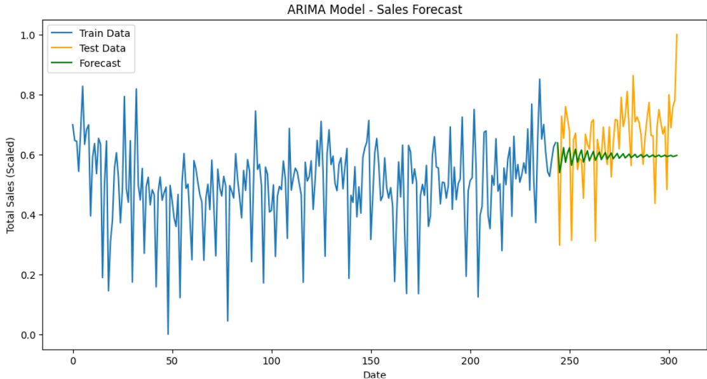

# Customer Segmentation & Sales Forecasting

Welcome to the Customer Segmentation & Sales Forecasting project! This repository combines data cleaning, analysis, clustering, and time-series forecasting to help businesses gain valuable insights into their customer base and future sales trends.

## Table of Contents
- [Project Overview](#project-overview)
- [Data Overview](#data-overview)
- [Dashboard Preview](#dashboard-preview)
- [Features](#features)
- [How to Run](#how-to-run)
- [Repository Structure](#repository-structure)
- [Future Enhancements](#future-enhancements)
- [Contributing](#contributing)
- [License](#license)

## Project Overview

This project demonstrates how to:
- Clean and preprocess raw retail sales data
- Segment customers using K-Means clustering to identify high-value and frequent buyers
- Forecast future sales using both ARIMA and Prophet models for robust time-series predictions
- Visualize insights through a Power BI dashboard, providing clear, actionable intelligence

**Goal**: Provide a complete, end-to-end solution for customer segmentation and sales forecasting that can be leveraged for strategic decision-making.

## Data Overview

The dataset contains the following columns:
- `InvoiceNo`: Unique identifier for each invoice
- `StockCode`: Product code
- `Description`: Product description
- `Quantity`: Number of items purchased
- `InvoiceDate`: Date of purchase
- `UnitPrice`: Price per unit
- `CustomerID`: Unique identifier for each customer
- `Country`: Customer's country
- `Revenue/TotalSales`: (Derived) Quantity * UnitPrice

**Note**: Data cleaning and preprocessing steps (handling missing values, removing outliers, etc.) are performed within the Jupyter Notebook.

## Dashboard Preview

Below is a placeholder for the Power BI (or other) dashboard you created to visualize key insights.

### Dashboard Highlights:
- Monthly Revenue Trends
- Top Countries by Sales
- Customer Segments & Key Metrics
- ARIMA & Prophet Forecast Overlays

Below is a preview of the Power BI dashboard visualizing key insights.


## Features

### K-Means Clustering
**Goal**: Segment customers into distinct groups based on:
- Revenue
- Frequency (number of purchases)
- Total Quantity purchased

**Outcome**: Identifies high-value customers, frequent buyers, and other segments to tailor marketing strategies.

### ARIMA Forecasting
**Goal**: Model time-series data (daily/weekly sales) to predict future sales.

**Key Steps**:
- Data Stationarity checks with ADF test
- Parameter Tuning (p, d, q) via Grid Search
- Forecast and evaluate with MSE/RMSE

### Prophet Forecasting
**Goal**: Leverage Facebook's Prophet for robust trend and seasonality detection.

**Key Steps**:
- Fit Prophet model on historical sales data
- Generate forecasts and visualize confidence intervals
- Evaluate using RMSE and compare with ARIMA results

## Visualizations

This section includes snapshots of key visualizations generated in the analysis:

### Customer Segmentation Clusters


*Figure 1: K-Means clustering results highlighting distinct customer groups based on revenue, frequency, and total quantity purchased.*

### Sales Forecast with ARIMA

*Figure 2: The ARIMA model forecast, showing the trend and confidence intervals for future sales.*

### Revenue Forecast with Prophet

*Figure 3: Prophet model forecast displaying seasonality and trend components along with predicted revenue.*


## How to Run

### Clone the Repository
```bash
git clone https://github.com/your-username/customer-sales-forecasting.git
cd customer-sales-forecasting
```

### Open the Jupyter Notebook
- Launch Jupyter or any environment (VS Code, Google Colab)
- Run all cells in the .ipynb file to reproduce the analysis, clustering, and forecasting results

### Explore the Dashboard
- If using Power BI, open the .pbix file located in the visuals folder
- Interact with charts and filters to gain deeper insights

## Repository Structure
```
customer-sales-forecasting/
├── dataset/                          # Contains the raw or cleaned dataset
├── visuals/                          # Images, dashboard files (e.g., .pbix)
├── e-commerce-invoice-dataset.ipynb  # Main Jupyter Notebook with all steps
└── README.md                         # Project documentation (this file)
```

## Future Enhancements
- Advanced Clustering: Try DBSCAN or hierarchical clustering for complex data distributions
- Seasonal Models: Explore SARIMA or other seasonal time-series approaches if strong seasonality is present
- Feature Engineering: Incorporate marketing campaigns, holidays, or product-level details
- Real-Time Forecasting: Stream data ingestion and live dashboards for dynamic updates

## Contributing
Contributions are welcome!
1. Fork this repository
2. Create a new branch for your feature or bug fix
3. Commit and push your changes
4. Open a Pull Request describing your changes

## Dataset  

The dataset used in this project is available on **Kaggle**.  
You can find it [here](https://www.kaggle.com/code/fabiendaniel/customer-segmentation/input).  


## License
This project is licensed under the [MIT License](https://opensource.org/licenses/MIT). Feel free to use and modify the code for your own projects.

---

Enjoy exploring the Customer Segmentation & Sales Forecasting project!

For any questions or suggestions, please open an issue.